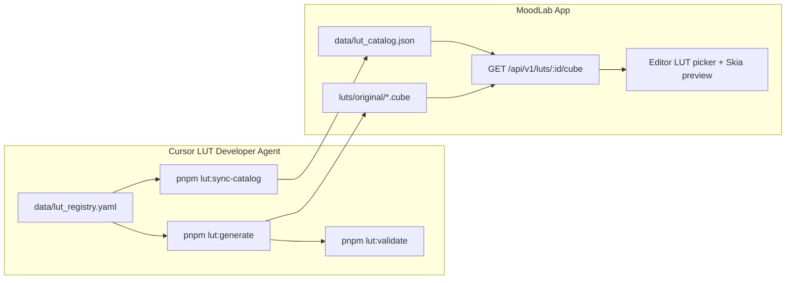

# Using the LUT Developer Agent in Cursor

The LUT Developer is a **Cursor subagent** — invoke it directly in Agent mode to author LUTs and deliver them to the MoodLab app.

## Invoke in Cursor

### Option 1: Ask Agent to delegate (recommended)

In Cursor Agent chat:

> Use the lut-developer subagent to create a warm portrait LUT called "Golden Studio" for the melanin-gold pack.

> @lut-developer batch 10 Streetwear LUTs from the taxonomy.

Agent discovers `.cursor/agents/lut-developer.md` automatically and delegates when the task matches.

### Option 2: Explicit task prompt

> Act as the MoodLab LUT Developer. Add a new LUT to lut_registry.yaml for a moody teal-orange cinematic look, generate, validate, sync catalog, and tell me how to verify in the app.

### Option 3: Open LUT files

Editing files under `luts/`, `data/lut_registry.yaml`, or `tools/lut-studio/` activates the `.cursor/rules/lut-developer.mdc` rule for context.

## What the agent produces



| Artifact | Path | App usage |
|----------|------|-----------|
| Grade spec | `data/lut_registry.yaml` | Source of truth (not read at runtime) |
| LUT file | `luts/original/<id>.cube` | Served by API, cached on device |
| Catalog | `data/lut_catalog.json` | LUT names, strength defaults, skin protection, packs |

## Verify delivery in the app

```bash
pnpm dev:api          # API on http://localhost:8787
pnpm dev:mobile       # Expo app
```

1. Confirm API: `curl http://localhost:8787/api/v1/luts/<id>/cube | head`
2. Open editor → Mood/LUT drawer → find new LUT by name
3. Check preview at default strength with skin protection on

## Agent files

| File | Role |
|------|------|
| [`.cursor/agents/lut-developer.md`](../../.cursor/agents/lut-developer.md) | **Cursor subagent** — invoke in Agent mode |
| [`.cursor/rules/lut-developer.mdc`](../../.cursor/rules/lut-developer.mdc) | Context rule when editing LUT paths |
| [`LUT_DEVELOPER.md`](./LUT_DEVELOPER.md) | Full domain knowledge |
| [`skills/moodlab-lut-developer/SKILL.md`](../../skills/moodlab-lut-developer/SKILL.md) | Optional global skill install |

## Typical session

1. **You**: "Create 5 Sunny pack LUTs for outdoor portraits"
2. **Agent**: Reads taxonomy → adds 5 registry entries → generates → validates → syncs
3. **You**: Review in app editor, request tweaks ("warmer, less saturation")
4. **Agent**: Adjusts `grade.params` in registry → regenerates → re-validates
5. **You**: Commit → LUTs ship with the repo

## Scaling to 1000 LUTs

Use Cursor Agent with the lut-developer subagent in batches:

> @lut-developer generate 50 LUTs from the Portrait taxonomy slice, validate all, sync catalog.

Human QA spot-checks Portrait/Music Cover LUTs in the app between batches.
