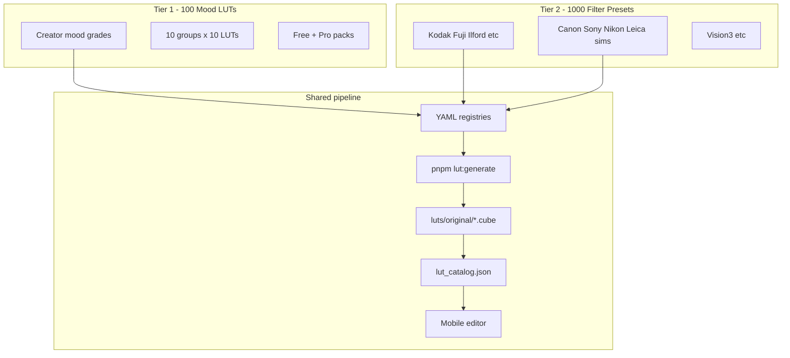

# MoodLab Catalog Master Plan

Strategic plan for **100 creator Mood LUTs** (grouped) + **~1000 film/camera filter presets** (Kodak, Fuji, etc.). Produced for `/super-intelligence` planning and executed via **`/loop`** + the `lut-developer` subagent.

## Two-tier catalog model



| Tier | Count | Purpose | Naming | Example |
|------|-------|---------|--------|---------|
| **Mood LUTs** | 100 | Creator/social emotional looks | Mood-first | "Golden Studio", "Alley Flash" |
| **Filter presets** | ~1000 | Film stock & camera color science | Stock/camera accurate | "Kodak Portra 400", "Fuji Classic Chrome" |

Both tiers ship as `.cube` files. Mood LUTs prioritize skin-safe creator workflows; filter presets prioritize stock accuracy with optional skin protection.

---

## Tier 1: 100 Mood LUTs (10 groups × 10)

**Current:** 51 shipped · **Remaining:** 49

See [`data/lut_100_plan.yaml`](../../data/lut_100_plan.yaml) for the full manifest with `status: shipped | planned`.

| # | Group | Pack | Plan | Shipped | Remaining |
|---|-------|------|------|---------|-----------|
| 1 | Melanin Portrait Studio | melanin-gold | pro | 7 | 3 |
| 2 | Sunny Creator | sunny-starts | free | 16 | 0* |
| 3 | Cinematic Blockbuster | dark-cinematic | free/pro | 14 | 0* |
| 4 | Streetwear Flash | creator-cover | pro | 11 | 0* |
| 5 | Music Cover Art | creator-cover | pro | 3 | 7 |
| 6 | Film Nostalgia | creator-cover | pro | 4 | 6 |
| 7 | Luxury Editorial | melanin-gold | pro | 2 | 8 |
| 8 | Viral Social | sunny-starts | free | 4 | 6 |
| 9 | Dark Night Mood | dark-cinematic | free | 4 | 6 |
| 10 | Black & White Editorial | dark-cinematic | pro | 1 | 9 |

\*Groups 2–4 exceed 10 per group because early batches overlapped categories. Groups 5–10 carry the remaining quota to reach exactly 100 unique mood LUTs.

### Group definitions

**1. Melanin Portrait Studio** — skin-safe warmth, studio and outdoor portrait, deep skin shadow detail.

**2. Sunny Creator** — bright, warm, golden-hour, beach, patio, viral-clean sunny.

**3. Cinematic Blockbuster** — teal-orange, bleach bypass, anamorphic, epic scope, noir.

**4. Streetwear Flash** — flash punch, grit alley, hype color, urban contrast.

**5. Music Cover Art** — afrobeat, amapiano, rnb, hip-hop punch, alt-indie, thumbnail legibility.

**6. Film Nostalgia** — kodak-gold mood, faded memory, cross-process feel, analog grain pairing.

**7. Luxury Editorial** — matte black, fashion runway, cool minimal, premium restraint.

**8. Viral Social** — clean scroll-stopping, punchy, pastel-pop, tiktok-bright.

**9. Dark Night Mood** — purple night, urban noir, low-key portrait, cover darkness.

**10. Black & White Editorial** — high contrast, soft matte, film noir, warm sepia mood-BW.

---

## Tier 2: ~1000 Filter / Camera Presets

See [`data/filter_preset_taxonomy.yaml`](../../data/filter_preset_taxonomy.yaml).

### Organization (10 families × ~100 each)

| Family | Count | Examples |
|--------|-------|----------|
| **Kodak** | 120 | Portra 160/400/800, Gold 200, Ektar 100, Tri-X 400, Vision3 500T/250D, Ektachrome |
| **Fuji** | 120 | Pro 400H, Velvia 50/100, Provia, Superia, Classic Chrome/Neg/Chrome sims |
| **Ilford** | 80 | HP5, Delta 100/400/3200, FP4, Pan F |
| **Agfa / Konica / Other film** | 80 | Agfa Vista, Konica Centuria, Lomography stocks |
| **Cinema film** | 100 | Kodak Vision3, Fuji Eterna, Kodak Double-X, bleach bypass variants |
| **Instant / Expired / Vintage** | 80 | Polaroid, expired warmth, faded chemical shifts |
| **Canon / Nikon / Sony digital sims** | 120 | Picture Control / Creative Style / Film Simulation recreations |
| **Leica / Hasselblad / Phase One** | 80 | Digital medium format color science approximations |
| **Mobile / Social camera** | 80 | iPhone vivid, Samsung vivid, VSCO-era digital, disposable camera |
| **Specialty / Cross-process / Infrared** | 140 | Cross-process, infrared false color, technicolor, duotone |

**Total target:** 1000

### Filter preset metadata (extends LutDefinition)

```yaml
kind: filter_preset          # vs mood_lut
manufacturer: Kodak
stock: Portra 400
iso: 400
character: [warm, soft, portrait]
skinProtectionDefault: high  # portrait stocks
recommendedEffects:
  grain: 0.18                # pair grain with film stocks
```

### Legal note

All presets are **original parametric emulations** inspired by public color-science references — not redistributed third-party `.cube` packs. See `docs/native/OPEN_SOURCE_RESOURCES.md`.

---

## Execution: `/loop` activation

Loop config: [`.cursor/loop/catalog-expansion.md`](../../.cursor/loop/catalog-expansion.md)

State tracker: [`.cursor/loop/state.json`](../../.cursor/loop/state.json)

### Paste into Cursor Composer

```
/loop --max-turns=15 --goal="100 mood LUTs shipped"

Read .cursor/loop/catalog-expansion.md and .cursor/loop/state.json.
Use the lut-developer subagent each iteration.

Each turn:
1. Pick next planned entries from data/lut_100_plan.yaml (status=planned)
2. Add to data/lut_registry.yaml (max 10 per turn)
3. pnpm lut:generate --all && pnpm lut:validate && pnpm lut:sync-catalog
4. Mark shipped in lut_100_plan.yaml
5. Update state.json, commit, push
6. Stop at 100 mood LUTs or max turns
```

Phase 2 loop (after 100 mood LUTs):

```
/loop --max-turns=50 --goal="1000 filter presets"

Read data/filter_preset_taxonomy.yaml and .cursor/loop/catalog-expansion.md.
Batch 20 filter presets per turn into data/filter_registry.yaml (create if missing).
Same generate/validate/sync pipeline. Stop at 1000 or max turns.
```

---

## Infrastructure roadmap

| Phase | Deliverable | Status |
|-------|-------------|--------|
| 1 | 100 mood LUT plan YAML | This doc |
| 2 | 1000 filter taxonomy YAML | This doc |
| 3 | Loop activation files | This doc |
| 4 | `data/filter_registry.yaml` + film stock recipes | Next |
| 5 | Catalog `kind` field in shared types | Next |
| 6 | API pagination/search for 1000+ items | Later |
| 7 | Thumbnail batch pipeline | Later |

---

## QA strategy at scale

| Tier | Portrait QA | Spot QA |
|------|---------------|---------|
| Mood LUTs (100) | 100% for Portrait/Music Cover | 20% others |
| Filter presets (1000) | 100% for portrait stocks (Portra, etc.) | 10% others |

Commands every batch: `pnpm lut:validate`, `pnpm test`, spot-check in app editor.

---

## Related files

- [`data/lut_100_plan.yaml`](../../data/lut_100_plan.yaml) — 100 mood LUT manifest
- [`data/filter_preset_taxonomy.yaml`](../../data/filter_preset_taxonomy.yaml) — 1000 preset taxonomy
- [`data/lut_registry.yaml`](../../data/lut_registry.yaml) — current source of truth (51 LUTs)
- [`.cursor/agents/lut-developer.md`](../../.cursor/agents/lut-developer.md) — subagent
- [`docs/agents/CURSOR_LUT_WORKFLOW.md`](./CURSOR_LUT_WORKFLOW.md) — Cursor usage
