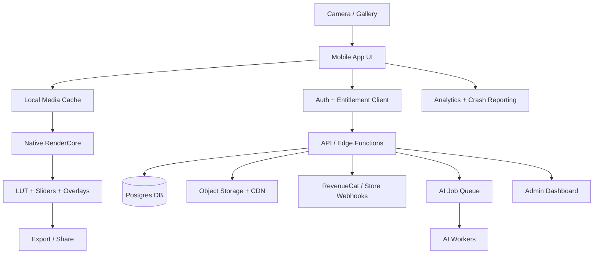

# MoodLab / VibeGrade — End-to-End Infrastructure & Architecture

## Core architecture principle
The app is a **local-first creative editor** with a **cloud-backed content, commerce, marketplace, AI, and analytics layer**.

Editing must be instant and offline-capable after packs are downloaded. Cloud services should handle identity, entitlements, pack distribution, optional sync, AI jobs, marketplace operations, and admin analytics.

## End-to-end diagram

## Recommended stack

| Area | Recommendation |
|---|---|
| Mobile UI | React Native or Flutter |
| iOS rendering | Core Image / Metal / CIColorCube |
| Android rendering | GPU shader path, OpenGL/Skia, AGSL RuntimeShader where appropriate |
| Backend | Supabase or managed Postgres-first backend |
| Storage | Supabase Storage or S3-compatible object storage + CDN |
| Payments | RevenueCat for mobile subscriptions and IAP |
| Marketplace payouts | Stripe Connect later |
| Analytics | Event pipeline + warehouse; PostHog/Amplitude/Mixpanel optional |
| Crash reporting | Sentry |
| AI | Async queue + Python/Node worker service |
| Admin | Next.js/React web dashboard |

## Critical flows

### Photo editing
1. Import photo.
2. Fix orientation and create preview.
3. Apply local LUT and adjustment stack.
4. Composite text/templates.
5. Export from original image.

### Premium pack download
1. User taps locked pack.
2. App checks entitlement.
3. If missing, show paywall.
4. Purchase through RevenueCat/store.
5. Webhook updates backend entitlement.
6. API returns short-lived signed URLs.
7. App downloads pack and validates checksum.
8. User edits offline with downloaded pack.

### AI look matching
1. User consents to upload source/reference photo.
2. API creates job.
3. Worker analyzes color distribution/style.
4. Worker creates custom recipe or LUT.
5. App receives completed job result.
6. Temporary images expire/delete.

### Creator marketplace upload
1. Creator uploads LUT pack.
2. Files go to private staging bucket.
3. Worker validates LUT format and renders test previews.
4. Admin reviews pack, metadata, thumbnails, licensing claim.
5. Approved pack moves to catalog.
6. Purchases create entitlement and payout ledger entries.

## Data model

- profiles
- lut_packs
- luts
- presets
- assets
- entitlements
- purchases
- edit_projects
- creator_profiles
- creator_payouts
- events
- moderation_reports

## Security controls

- Row Level Security for user-owned rows.
- Signed URLs for premium/private assets.
- Server-side entitlement checks.
- Validated webhooks for purchases.
- Strict LUT parser and sandboxed preview generation.
- User consent before uploading photos for AI.
- Short TTL for AI temporary assets.
- Admin audit logs and MFA.
