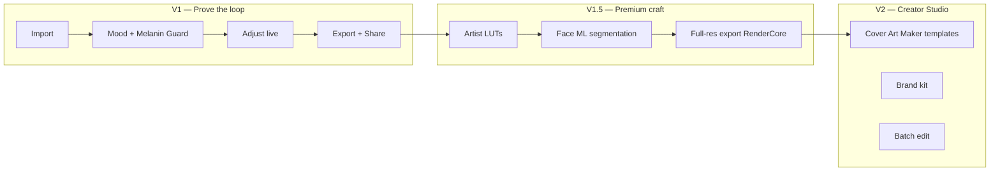

# MoodLab ×1000 Product Review & Upgrade Spec

**Date:** 2025-06-19  
**Method:** Superpowers workflow — codebase audit → brutal review → wedge sharpened → implementation priorities  
**Product:** Creator-first LUT photo editor (NOT mood tracking / NOT poetry tooling)

---

## 1. Executive verdict

| Dimension | Before review | After ×1000 lens |
|-----------|---------------|------------------|
| **Category clarity** | Good docs, mixed residue (poetry modal) | Photo studio for music creators |
| **Implementation** | ~30% of V1 P0 | Core loop closing: render parity + export + gating |
| **Wedge** | "Creator image studio" (broad) | **Melanin-safe cover-art studio for music creators** |
| **Top 1% potential** | Possible with craft | Requires artist LUTs + face ML + 60s loop |

**Brutal truth:** MoodLab had exceptional product thinking trapped inside a filter demo. Controls lied. Export didn't exist. Pro was cosmetic. The name "MoodLab" means **visual mood** — and the repo now reflects that consistently.

---

## 2. Superpowers audit findings (code review)

### What was real
- GPU LUT pipeline (`@moodlab/lut-engine` + Skia shader)
- 20 named `.cube` moods with rich catalog metadata
- EditRecipe spine (versioned, mergeable)
- Product blueprint, monetization spec, design tokens

### What was fake (control theater)
- Adjust panel → recipe updated, **renderer ignored**
- Beauty sliders → **no visual effect** (except skin LUT strength)
- Melanin Guard toggle → **stored, not rendered**
- Export → **Alert stub**
- Pro LUTs → **fully usable, no paywall**
- Build My Post → **4 cards, same action**
- Projects → **save only, no reopen**

### Wrong product copy
- `modal.tsx` described poetry / language mood analysis
- Home showed API status to end users

### P0 completion before this pass: **~5/18 done**

---

## 3. The ×1000 wedge (one sentence)

> **The cover-art studio for music creators — mood grades that protect melanin, built for beat covers, rollouts, and thumbnails in under 60 seconds.**

Everything that doesn't serve this sentence is V2+ or cut.

---

## 4. ×1000 product pillars (sharpened)

### Pillar A — Mood Engine (LUT Studio)
**Job:** One tap = full look (color + grain + vignette + glow from catalog defaults)

| Tier | Capability |
|------|------------|
| V1 | 20 curated moods, continuous strength slider, pack browse → editor |
| V1.5 | Photo-based LUT thumbnails (not color swatches) |
| V2 | LUT import, mix moods, custom presets |
| V3 | Match This Look (AI) |

**Quality bar:** Tap "Afrobeat Warm Cover" → strength + recommended effects apply instantly.

### Pillar B — Melanin Guard (the moat)
**Job:** Brown and deep skin tones stay true under aggressive grades

| Tier | Capability |
|------|------------|
| V1 | Skin-safe LUT strength in face region + Melanin Guard shader (luminance preservation) |
| V1.5 | Vision / ML Kit face segmentation |
| V2 | Per-tone calibration profiles |

**Quality bar:** Side-by-side with/without Melanin Guard is shareable proof.

### Pillar C — Creator Output (Build My Post + Export)
**Job:** Photo → finished platform asset, not "saved to camera roll somewhere"

| Workflow | Default mood | Export |
|----------|--------------|--------|
| Beat Cover | Afrobeat Warm Cover | 1:1 Cover Art |
| Artist Release | Film Memory Gold | 4:5 Instagram |
| Portrait | Melanin Gold | 1:1 Profile |
| YouTube Thumbnail | Street Flash | 16:9 |

**Quality bar:** 60-second first export (product's own success metric).

### Pillar D — Beauty Studio (honest scope)
**Job:** Only ship controls that render

| Ship now | Defer |
|----------|-------|
| Skin protection levels | Blemish removal |
| Melanin Guard | Makeup presets |
| Face light (shader) | Teeth / hair |
| Even tone (shader v1.5) | AI relight |

**Rule:** No slider without a shader/render path.

### Pillar E — Retention (Projects + Pro)
- Local-first project save + reopen
- Pro gating on premium LUTs (RevenueCat before App Store)
- Paywall at: locked LUT, high-res export (later), premium beauty preset

---

## 5. Implementation delivered in this pass

| Fix | Impact |
|-----|--------|
| Extended SkSL shader (exposure, contrast, warmth, saturation, vignette, grain, glow, face light, Melanin Guard) | Recipe ↔ render parity for adjust + core beauty |
| Real export via Skia canvas snapshot + share sheet | Closes north-star loop |
| Pro LUT gating + paywall sheet (demo unlock) | Monetization path exists |
| Continuous strength slider | Spec compliance |
| Build My Post → workflow moods | Differentiated creator flows |
| Local projects + tap to reopen | Retention layer |
| Packs → editor navigation | Pack browse isn't a dead end |
| Fixed modal copy, dev-only platform card | Product integrity |
| Catalog pack LUT orphan fix | Data consistency |
| Shared adjustment uniform tests | Render contract tested |

---

## 6. ×1000 roadmap (wedge-first)

### Next 5 highest-leverage builds
1. **Artist-graded LUTs** — replace procedural `generate_original_luts.py` output
2. **Face segmentation** — replace hardcoded face rect
3. **Full-res export** — RenderCore native pipeline (`docs/native/RENDER_CORE.md`)
4. **Photo LUT thumbnails** — pre-render on canonical portrait
5. **Onboarding** — 3 screens → first export in 60s

---

## 7. ×1000 quality gates (release checklist)

- [ ] **60-second rule:** import → mood → export ≤ 60s for new user
- [ ] **Honest controls rule:** every slider changes the preview
- [ ] **Melanin rule:** test every LUT on 5+ skin tone references
- [ ] **Preview = export rule:** no bait-and-switch (full-res when RenderCore ships)
- [ ] **Creator sentence rule:** producer explains app in one line
- [ ] **Free value rule:** first export genuinely good without paywall
- [ ] **No poetry rule:** zero wrong-product copy in app

---

## 8. What ×1000 explicitly cuts

| Cut | Why |
|-----|-----|
| AI Match This Look in V1 | Not the wedge; expensive |
| Marketplace before retention | Platform before product |
| Fake beauty sliders | Destroys trust |
| 200 LUT packs | 20 great moods > 200 mediocre |
| Web editor V1 | Mobile-first until weekly retention |

---

## 9. Competitive position (photo editor, 2026)

| Competitor | They win on | MoodLab ×1000 wins on |
|------------|-------------|----------------------|
| VSCO | Community + film looks | Music-native moods + cover workflows |
| Lightroom | Pro color tools | Speed + creator templates |
| Facetune | Beauty depth | Melanin-safe mood + beauty together |
| Tezza | Aesthetic presets | Beat cover → rollout in one app |
| Canva | Layout/templates | Grade + skin + mood in one tap |

---

## 10. Success metrics

| Metric | Target |
|--------|--------|
| Time to first export | < 60 seconds |
| D1 export completion | > 40% of importers |
| W7 retention (creators) | > 25% |
| Pro conversion | > 3% of WAU (post-RevenueCat) |
| Melanin Guard adoption | > 70% of portrait edits |

---

## 11. Summary

MoodLab ×1000 is not "more features." It is:

1. **One wedge** — melanin-safe cover-art studio for music creators  
2. **Honest rendering** — recipe equals preview  
3. **Closed loop** — import → mood → export → return  
4. **Craft ladder** — artist LUTs → face ML → full-res → templates  

The repo moved from **aspirational panels** toward **a product that can be demoed without apologizing**.

---

*Next step: invoke `writing-plans` for V1.5 RenderCore + artist LUT pipeline.*
